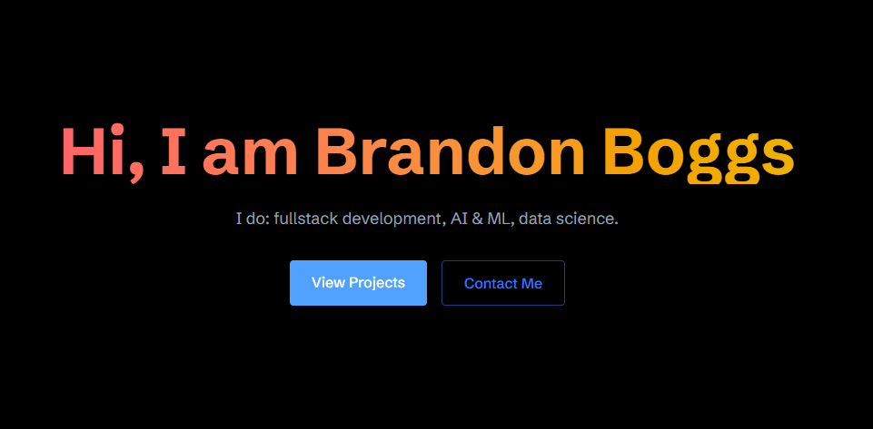
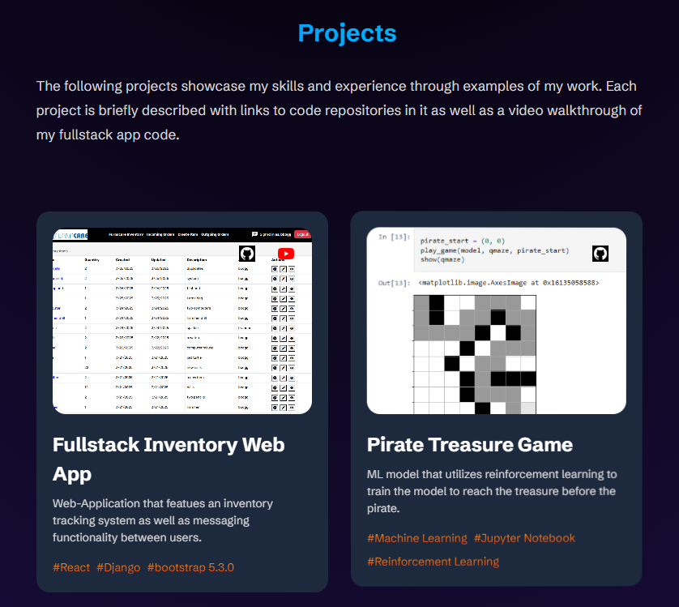
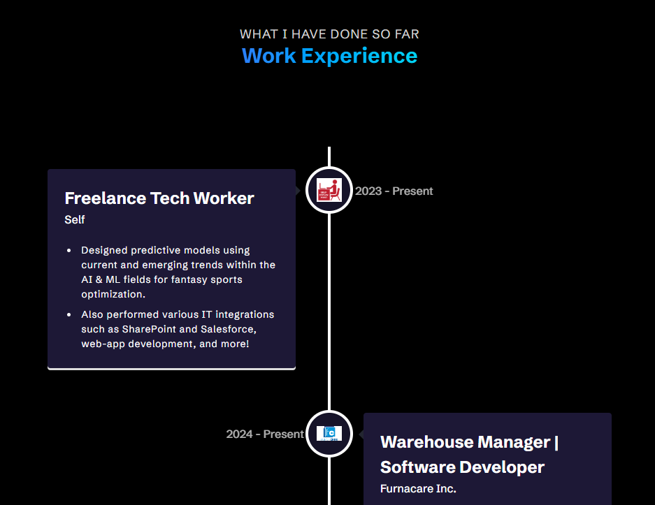
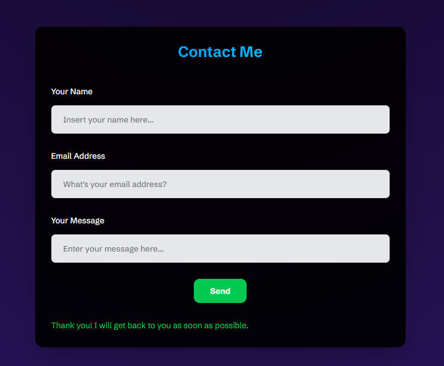

# Brandon Boggs' Portfolio Website

Welcome to my personal portfolio! This site showcases my skills and projects built with React and Tailwind CSS, along with modern animation techniques using Framer Motion and custom scroll reveal effects.

---

## 🚀 Live Demo

> View the live site here: [bboggs-portfolio](https://boggs-brandon21.github.io/bboggs-portfolio)

---

## 📋 Table of Contents

- [About](#about)
- [Features](#features)
- [Tech Stack](#tech-stack)
- [Screenshots](#screenshots)
- [Installation](#installation)
- [Usage](#usage)
- [Project Structure](#project-structure)
- [Customization](#customization)
- [Contributing](#contributing)
- [License](#license)
- [Contact](#contact)

---

## 💡 About

This portfolio website is a responsive, single-page application built to demonstrate my proficiency in React and Tailwind CSS. It includes:

- A dynamic Projects section with interactive project cards.
- An Experience timeline rendered via `react-vertical-timeline-component`.
- A contact form with email sending functionality.
- Smooth scroll reveal and fade-in animations.
- A custom radial gradient background and corner flame effects for visual flair.

---

## ✨ Features

- **Responsive Design**: Mobile-first layout that adapts seamlessly to all screen sizes.
- **Animations**: Leveraging Framer Motion for text and component fade-ins.
- **Scroll Effects**: Custom `RevealOnScroll` hook to animate elements into view.
- **Project Cards**: Project previews with conditional rendering for GitHub and YouTube links.
- **Experience Timeline**: Chronological timeline of work experience using `react-vertical-timeline-component`.
- **Contact Form**: Validated form fields with email submission, form state management, and user feedback.
- **Tailwindcss**: Utility-first styling with custom theming and extended background utilities.

---

## 🛠️ Tech Stack

- **Frontend:** React, Vite
- **Styling:** Tailwind CSS, PostCSS
- **Animations:** Framer Motion, custom hooks
- **Forms:** React Hook Form (or custom state management)
- **Version Control:** Git & GitHub Pages

---

## 📸 Screenshots









---

## ⚙️ Installation

1. **Clone the repo**

   ```bash
   git clone https://github.com/boggs-brandon21/bboggs-portfolio.git
   cd bboggs-portfolio
   ```

2. **Install dependencies**

   ```bash
   npm install
   # or
   yarn install
   ```

3. **Start the development server**

   ```bash
   npm run dev
   # or
   yarn dev
   ```

4. Open your browser at `http://localhost:3000` (or the port shown in your terminal).

---

## ▶️ Usage

- **Build for production**
  ```bash
  npm run build
  # or
  yarn build
  ```

- **Preview the production build**
  ```bash
  npm run preview
  # or
  yarn preview
  ```

- Deployed via GitHub Pages on the `gh-pages` branch.

---

## 📂 Project Structure

```
my-portfolio/
├─ public/
│  └─ index.html
├─ src/
│  ├─ assets/            # Images, icons, screenshots
│  ├─ components/        # Reusable UI components
│  ├─ constants/         # Data such as project list, experiences
│  ├─ pages/             # Section wrappers (Projects, Experience, Contact)
│  ├─ styles/            # Tailwind overrides & global CSS
│  ├─ App.jsx            # Root component
│  └─ main.jsx           # Entry point
├─ eslint.config.js    # ESLint config & custom utilities
├─ package.json
└─ README.md
```

---

## 🔧 Customization

- **Modify Projects**: Edit `src/constants/projects.js` to add, remove, or update project cards.
- **Update Experience**: Edit `src/constants/experiences.js` for your work history.
- **Theme & Styles**: Customize Tailwind config (`tailwind.config.js`) for colors, fonts, or extended utilities.
- **Animations**: Tweak `framer-motion` variants in `src/utils/motion.js`.

---

## 🤝 Contributing

Contributions are welcome! Follow these steps:

1. Fork the repository.
2. Create a feature branch (`git checkout -b feature/my-change`).
3. Commit your changes (`git commit -m 'Add some feature'`).
4. Push to the branch (`git push origin feature/my-change`).
5. Open a Pull Request.

Please ensure code is well-formatted and documented.

---

## 📄 License

This project is open-source and available under the [MIT License](LICENSE).

---

## 📬 Contact

- **Author:** Brandon Boggs
- **Email:** bboggs2121@gmail.com
- **Portfolio:** https://boggs-brandon21.github.io/bboggs-portfolio

